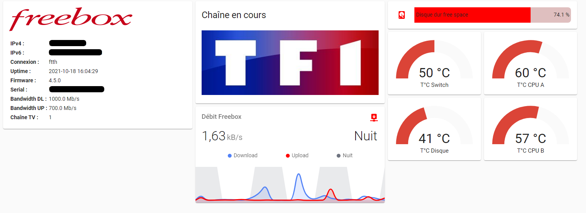

# Mon dashboard Freebox sur Home Assistant

## Pre-requis

- Avoir une Freebox
- Un home assistant fonctionnel
- Un HACS fonctionnel

## Mise en place des composants

Installer et configurer l'intégration dans HACS :  

  - **mini-graph-card**
  - **bar-card**

## Configuration

......

Le contenu du fichier **sensor.yaml** est à mettre dans votre **configuration.yaml** ou fichier YAML de configuration sensor.  
Il y a SSID01 à SSID04, c'est à modifier par vos SSID, j'en ai 4 pour mes besoins.  
  
    
Dans le **dashboard.yaml** le contenu pour les dashboards (mettre l'image unifi sur le serveur HA et modifier l'IP de l'UDM pour le lien HTTPS).  
Il y en a un pour les infos Unifi et l'autre pour bloquer les accès réseaux.  

Note : le logo unifi est dans le dossier **assets** et le mettre dans le dossier HA : **/config/www/pics** (peut être à créer).
Modifier les entitées qui correspondent à vos machines, rechercher **switch.machineaaa**.

## Résultat

