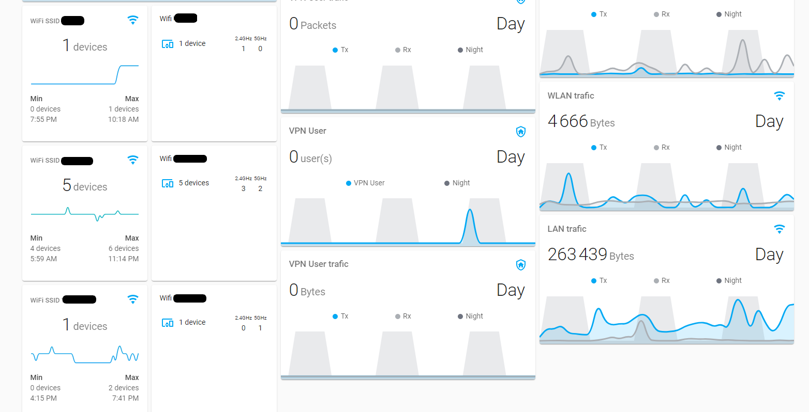

# Mon dashboard Unifi sur Home Assistant

## Pre-requis

- Avoir du matériel Unifi, ici un UDM
- Un home assistant fonctionnel
- Un HACS fonctionnel
- Créer un compte admin sur l'UDM 

## Mise en place des composants

Installer et configurer l'intégration **UniFi Network** disponible de base sous HA.  
Installer et configurer l'intégration **Sensor.Unifigateway** sous HACS.

